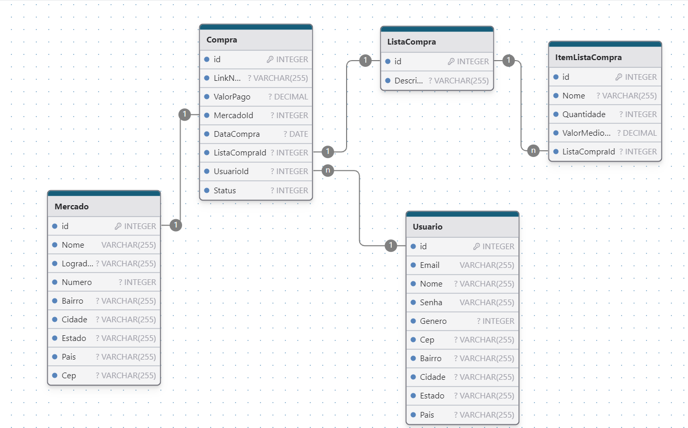

# The House

### Objetivo e funcionalidades
O The House é um sistema desenvolvido para facilitar a gestão financeira e organizacional de uma residência. Sua principal função é permitir o controle eficiente de despesas e atividades domésticas, oferecendo uma solução centralizada para diversos aspectos do dia a dia.

Com o The House, será possível monitorar contas fixas (como luz, água, telefone, gás) e despesas periódicas (como cartão de crédito e compras pontuais), ajudando a visualizar e planejar os custos de maneira mais precisa.

Além disso, o sistema também serve como um centro de entretenimento, onde os participantes podem marcar lugares visitados e destinos para futuras visitas, além de organizar listas de filmes assistidos e por assistir, listas de desejos e muito mais.

Outro recurso essencial é o controle de lista de compras, permitindo que o usuário adicione itens para futuras aquisições, registre os valores e armazene links para as notas fiscais, facilitando o acompanhamento das despesas mensais. O sistema conta ainda com uma funcionalidade de controle de estoque, que permite registrar e monitorar os itens essenciais para as compras do mês.

O The House é uma solução completa para quem busca praticidade e organização no dia a dia doméstico.

### Tecnologias utilizadas
- Frontend: Inicialmente seria utilizado a tecnologia Vue.js porém foi alterado para Angular
- Backend:
    - Linguagem: C#
    - ORM: EntityFramework
    - Segurança de acesso: JsonWebToken
- Banco de dados: PostgreSQL

### Modelo de banco de dados das entidades de compras

