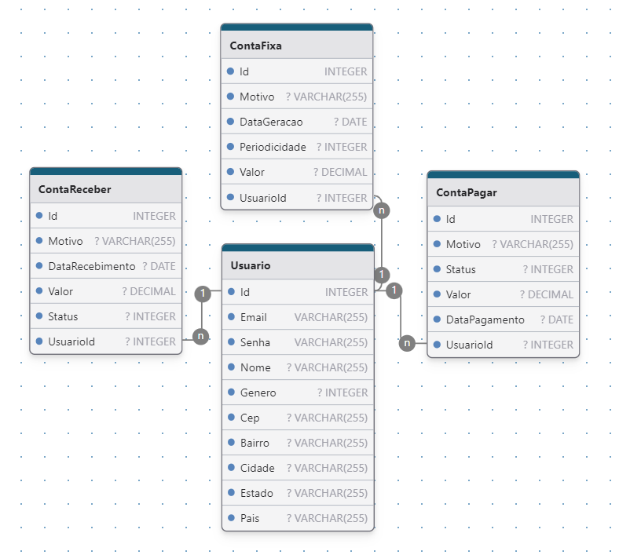

# The House

### Objetivo e funcionalidades
O The House é um sistema desenvolvido para facilitar a gestão financeira e organizacional de uma residência. Sua principal função é permitir o controle eficiente de despesas e atividades domésticas, oferecendo uma solução centralizada para diversos aspectos do dia a dia.

Com o The House, será possível monitorar contas fixas (como luz, água, telefone, gás) e despesas periódicas (como cartão de crédito e compras pontuais), ajudando a visualizar e planejar os custos de maneira mais precisa.

Além disso, o sistema também serve como um centro de entretenimento, onde os participantes podem marcar lugares visitados e destinos para futuras visitas, além de organizar listas de filmes assistidos e por assistir, listas de desejos e muito mais.

Outro recurso essencial é o controle de lista de compras, permitindo que o usuário adicione itens para futuras aquisições, registre os valores e armazene links para as notas fiscais, facilitando o acompanhamento das despesas mensais. O sistema conta ainda com uma funcionalidade de controle de estoque, que permite registrar e monitorar os itens essenciais para as compras do mês.

O The House é uma solução completa para quem busca praticidade e organização no dia a dia doméstico.

### Tecnologias e Metodologias utilizadas
- Frontend: 
    - Linguagem: Typescript
    - Frameworks: Angular
- Backend:
    - Arquitetura: Arquitetura baseada em camadas utilizando os principios da Clean Architecture para escalabilidade e manutenção do sistema.
    - Linguagem: C#
    - ORM: EntityFramework
    - Segurança de acesso: JsonWebToken
    - Ferramenta para testes de rota: Swagger e Postman
    - Pacotes:
        - Microsoft.EntityFrameworkCore | (Pacote que permite a utilização de ORM)
        - Npgsql.EntityFrameworkCore.PostgreSQL | (Pacote que permite a integração com o banco de dados PostgreSQL)
        - AutoMapper | (Para mapeamento de entidades para DTOs e vice-versa)
        - IdentityModel.Tokens.Jwt | (Para geração de tokens de acessos)
        - AspNetCore.Authentication.JwtBearer | (Utilização do token no padrão Bearer)
        
- Banco de dados: PostgreSQL

### Modelo de banco de dados das entidades de compras

A tabela está organizada desta forma com o Objetivo de facilitar a manipulação e inserção de dados, onde será possível criar as listas de compras independente da compra realizada.
- Mercado(Id, Nome, Logradouro, Numero, Bairro, Cidade, Estado, Pais, Cep)
- ListaDeCompra(Id, Descricao)
- ItemListaCompra(Id, Nome, Quantidade, ValorMedioItem, ListaCompraId)
- Compra(Id, LinkNota, ValorPago, DataCompra, Status, MercadoId, ListaDeCompraId, UsuarioId)

### Modelo de banco de dados das entidades de Finanças

O Usuario terá vários tipos de contas vinculadas, tanto despesa como receita, a ideia da organização é que a conta fixa (que se trata de contas mensais e continuas como conta de luz, agua, internet e telefone) gere uma conta a pagar no mês.
- ContaFixa(Id, Motivo, DataGeracao, Periodicidade, Valor, UsuarioId)
- ContaPagar(Id, Motivo, Status, Valor, DataPagamento, UsuarioId)
- ContaReceber(Id, Motivo, DataRecebimento, Valor, Status, UsuarioId)